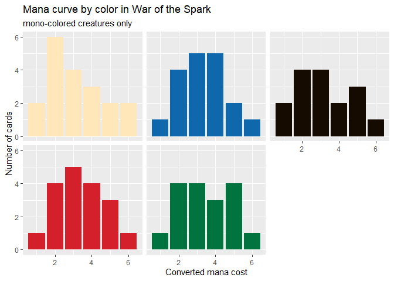

scryr
================

[](https://www.tidyverse.org/lifecycle/#experimental)

scryr provides R functions to access Scryfall’s APIs for
[catalogs](https://scryfall.com/docs/api/catalogs),
[sets](https://scryfall.com/docs/api/sets), and [card
search](https://scryfall.com/docs/api/cards/search).

# Installation

Install scryr from Github with
[devtools](https://cran.r-project.org/web/packages/devtools/index.html)

``` r
# install.packages("devtools")
library(devtools)
install_github("khailper/scryr")
```

# Usage

``` r
library(tidyverse)
library(scryr)
```

## scry\_catalog()

Scryfall catalogs contain each unique value of the catalogs content,
returned as a vector of strings. So, if you wanted every enchantment
subtype:

``` r
scry_catalog("enchantment-types")
```

    ## [1] "Aura"      "Cartouche" "Curse"     "Saga"      "Shrine"

The list of available catalogs can be found with `?scry_catalog`.

## scry\_sets()

`scry_sets` can either return a tibble containing the information for
all sets (the default), or `scry_sets("set's three letter")` to get just
the information for that set.

``` r
scry_sets("war")
```

    ## # A tibble: 1 x 17
    ##   object id    code  mtgo_code tcgplayer_id name  uri   scryfall_uri
    ##   <chr>  <chr> <chr> <chr>            <int> <chr> <chr> <chr>       
    ## 1 set    ee04~ war   war               2418 War ~ http~ https://scr~
    ## # ... with 9 more variables: search_uri <chr>, released_at <chr>,
    ## #   set_type <chr>, card_count <int>, digital <lgl>, foil_only <lgl>,
    ## #   block_code <chr>, block <chr>, icon_svg_uri <chr>

## scry\_cards()

`scry_cards()` returns a tibble containing cards matching the seach in
the `query`arguement. So, if we instead of wanting the information about
**War of the Spark**, we wanted all cards in that set:

``` r
war_cards <- scry_cards("s:war")
war_cards
```

    ## # A tibble: 265 x 52
    ##    object multiverse_ids name  lang  released_at layout highres_image
    ##    <chr>  <list>         <chr> <chr> <chr>       <chr>  <lgl>        
    ##  1 card   <int [1]>      Ahn-~ en    2019-05-03  normal TRUE         
    ##  2 card   <int [1]>      Aid ~ en    2019-05-03  normal TRUE         
    ##  3 card   <int [1]>      Ajan~ en    2019-05-03  normal TRUE         
    ##  4 card   <int [1]>      Ajan~ en    2019-05-03  normal TRUE         
    ##  5 card   <int [1]>      Angr~ en    2019-05-03  normal TRUE         
    ##  6 card   <int [1]>      Angr~ en    2019-05-03  normal TRUE         
    ##  7 card   <int [1]>      Arbo~ en    2019-05-03  normal TRUE         
    ##  8 card   <int [1]>      Arli~ en    2019-05-03  normal TRUE         
    ##  9 card   <int [1]>      Arli~ en    2019-05-03  normal TRUE         
    ## 10 card   <int [1]>      Ashi~ en    2019-05-03  normal TRUE         
    ## # ... with 255 more rows, and 45 more variables: mana_cost <chr>,
    ## #   cmc <dbl>, type_line <chr>, oracle_text <chr>, power <chr>,
    ## #   toughness <chr>, colors <list>, color_identity <list>, games <list>,
    ## #   reserved <lgl>, foil <lgl>, nonfoil <lgl>, oversized <lgl>,
    ## #   promo <lgl>, reprint <lgl>, set <chr>, set_name <chr>,
    ## #   collector_number <chr>, digital <lgl>, rarity <chr>,
    ## #   flavor_text <chr>, artist <chr>, border_color <chr>, frame <chr>,
    ## #   full_art <lgl>, story_spotlight <lgl>, edhrec_rank <int>,
    ## #   loyalty <chr>, all_parts <list>, frame_effect <chr>,
    ## #   legalities.standard <chr>, legalities.future <chr>,
    ## #   legalities.frontier <chr>, legalities.modern <chr>,
    ## #   legalities.legacy <chr>, legalities.pauper <chr>,
    ## #   legalities.vintage <chr>, legalities.penny <chr>,
    ## #   legalities.commander <chr>, legalities.duel <chr>,
    ## #   legalities.oldschool <chr>, prices.usd <chr>, prices.usd_foil <chr>,
    ## #   prices.eur <chr>, prices.tix <chr>

`scry_cards` also supports more complex searches (the query syntax is
available at <https://scryfall.com/docs/syntax>):

``` r
# all mono-colored creatures in War of the Spark"
scry_cards("set:war t:'creature' c:1") %>% 
  # need to unlist colors so it can be a grouping variable for count
  mutate(colors = unlist(colors),
         colors = fct_relevel(colors, "W", "U", "B", "R", "G")) %>% 
  # getting each color's mana curve
  count(cmc,colors) %>% 
  ggplot(aes(cmc, n, fill = colors)) +
  geom_col() +
  facet_wrap(~colors) + 
  guides(fill = FALSE) + 
  labs(title = "Mana curve by color in War of the Spark",
       subtitle = "mono-colored creatures only",
       x = "Converted mana cost", 
       y = "Number of cards") +
  theme(strip.background = element_blank(), strip.text.x = element_blank()) +
  scale_fill_manual(values = c("W" = "#ffe7b9",
                               "U" = "#0e68ab",
                               "B" = "#150b00",
                               "R" = "#d3202a",
                               "G" = "#00733e"))
```

<!-- -->

Note: both `scry_sets` and `scry_cards` by default drop columns related
containing IDs and URIs. This can be overridden with `include_ids =
TRUE` and `include_uris = TRUE`, respectively.

scryr is unofficial Fan Content permitted under the Fan Content Policy.
Not approved/endorsed by Wizards. Portions of the materials used are
property of Wizards of the Coast. ©Wizards of the Coast LLC.

scryr is not endorsed or supported by Scryfall. Any use of scryr is
subject to Scryfall’s “Use of Scryfall Data” policy at
<https://scryfall.com/docs/api>.

Please note that the ‘scryr’ project is released with a [Contributor
Code of Conduct](.github/CODE_OF_CONDUCT.md). By contributing to this
project, you agree to abide by its terms.
